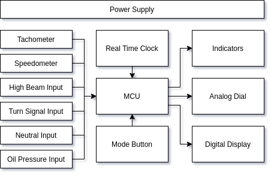
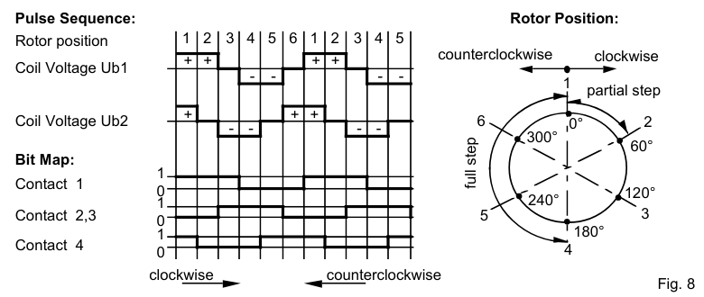
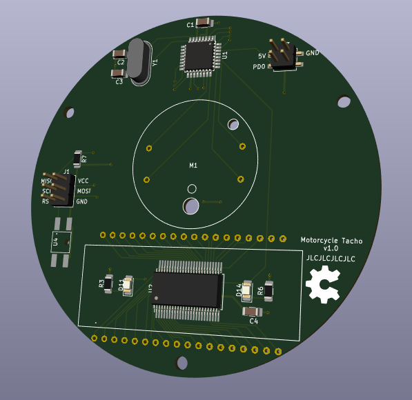
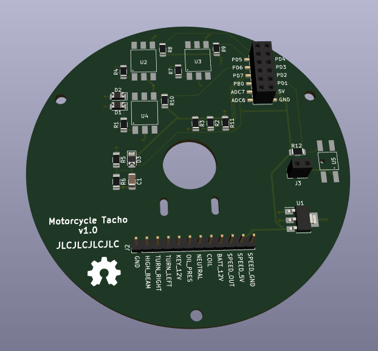
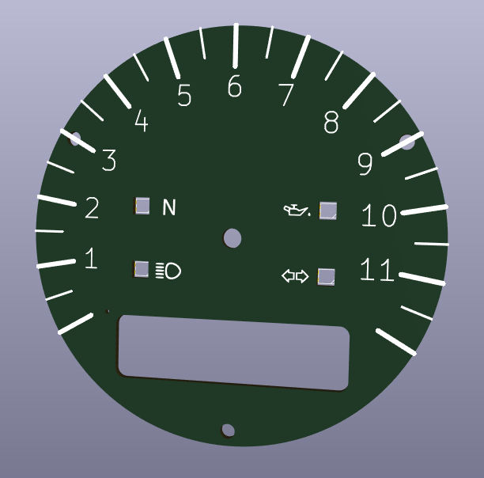
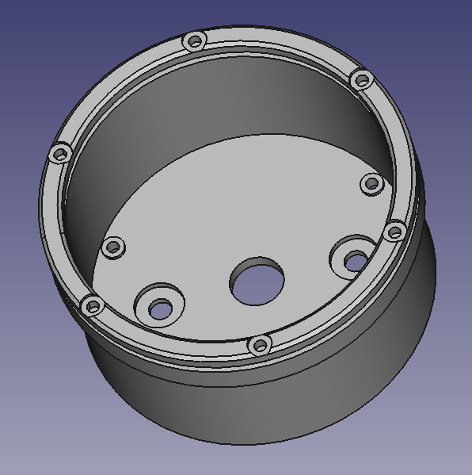

# Motorcycle Tacho

## Introduction

This is an open source motorcycle tacho project with the following features:

- Analog tachometer
- Digital speedometer
- Odometer
- Trip meter
- Battery voltage
- Standard indicators (turn signals, oil pressure, neutral and high beam)
- Clock

It is housed in a classic round casing, with a retro looking 8 digit starburst LCD.

## System Design

The system design is simple, the only interesting decision is that the indicators all go via the microcontroller, this lets us do fun things with the indicators (test them when powered on or reuse the oil pressure indicator for other warnings).

## Microcontroller

An ATmega328P-PU microcontroller will be used to process all the inputs, and drive the outputs.

Here are all the required inputs and outputs:

| Function        | Type           | Number of pins             |
| --------------- | -------------- | -------------------------- |
| Tacho           | Digital input  | 1                          |
| Speedo          | Digital input  | 1                          |
| Oil pressure    | Digital input  | 1                          |
| Turn signals    | Digital input  | 2                          |
| Neutral         | Digital input  | 1                          |
| High beam       | Digital input  | 1                          |
| Mode button     | Digital input  | 1                          |
| Battery voltage | Analog input   | 1                          |
| Stepper motor   | Digital output | 4 (could be 3)             |
| RBG LEDs        | Digital output | 1                          |
| LCD Backlight   | Digital output | 1                          |
| LCD             | Digital output | 3                          |
| ISP             | Digital IO     | 3 (can be shared with LCD) |
| Real time clock | Digital IO     | 2                          |

For a total of 19 digital IOs and one analog input, the ATmega328P-PU has more than enough at 23 programmable IO lines.

The ATmega328P-PU also has 1024 bytes of EEPROM which can be used to store the configuration, trip and odometer values.

An external 16 MHz crystal will be used to run the ATmega328P-PU at it's fastest clock speed.

The low byte fuses configure the clock:

| Bit | Name   | Description                                | Value |
| --- | ------ | ------------------------------------------ | ----- |
| 7   | CKDIV8 | When set, divides the clock speed by 8     | 1     |
| 6   | CKOUT  | When set, the clock pulse is output on PB0 | 1     |
| 5   | SUT1   | Sets start up delay time                   | 1     |
| 4   | SUT0   |                                            | 1     |
| 3   | CKSEL3 | Sets the clock source                      | 1     |
| 2   | CKSEL2 |                                            | 1     |
| 1   | CKSEL1 |                                            | 1     |
| 0   | CKSEL0 |                                            | 1     |

The high byte fuses:

| Bit | Name     | Description                               | Value |
| --- | -------- | ----------------------------------------- | ----- |
| 7   | RSTDISBL | External reset disable                    | 1     |
| 6   | DWEN     | Debug wire enable                         | 1     |
| 5   | SPIEN    | Enable serial programming                 | 0     |
| 4   | WDTON    | Watchdog timer always on                  | 1     |
| 3   | EESAVE   | Preserve EEPROM memory through chip erase | 0     |
| 2   | EBOOTSZ1 | Sets the bootloder size memory            | 1     |
| 1   | EBOOTSZ0 |                                           | 1     |
| 0   | BOOTRST  | Select the reset vector                   | 0     |

The extended fuses:

| Bit | Name      | Description                       | Value |
| --- | --------- | --------------------------------- | ----- |
| 7   |           | Not used                          | 1     |
| 6   |           |                                   | 1     |
| 5   |           |                                   | 1     |
| 4   |           |                                   | 1     |
| 3   |           |                                   | 1     |
| 2   | BODLEVEL2 | Sets the brown-out detector level | 1     |
| 1   | BODLEVEL1 |                                   | 0     |
| 0   | BODLEVEL0 |                                   | 1     |

The microcontroller will be programmed with an in-circuit serial programmer (ICSP). A bootloader doesnt need to be burned when using ICSP.

## Tachometer

## Speedometer

## LCD

The VIM-878-DP-FC-S-LV LCD display will be used.
It is a transflective LCD so works well in both bright sunlight and at night with a backlight.
It is an 8 character 14 (plus 2) segment "starburst" display.
It has a total of (14 + 2) \* 8 = 128 segments and uses 4 backplanes.

The HT1621B will be used to drive the LCD.
There are some existing Arduino libraries to interface with it.
It can drive 32 segments by 4 commons which is exactly what is required to drive the selected LCD.

The wiring of the driver to the display is optimised for the PCB layout.

This table has the LCD segments from the datasheet and what memory address they are according to the PCB layout:

| LCD Pin | COM0 | COM1 | COM2 | COM3 | Memory address |
| ------- | ---- | ---- | ---- | ---- | -------------- |
| 1       | 1D   | 1E   | 1F   | CA1  | 4              |
| 2       | 1L   | 1K   | 1J   | 1I   | 2              |
| 3       | 2D   | 2E   | 2F   | CA2  | 0              |
| 4       | 2L   | 2K   | 2J   | 2I   |                |
| 5       | 3D   | 3E   | 3F   | CA3  |                |
| 6       | 3L   | 3K   | 3J   | 3I   |                |
| 7       | 4D   | 4E   | 4F   | CA4  |                |
| 8       | 4L   | 4K   | 4J   | 4I   |                |
| 9       | 5D   | 5E   | 5F   | CA5  |                |
| 10      | 5L   | 5K   | 5J   | 5I   |                |
| 11      | 6D   | 6E   | 6F   | CA6  |                |
| 12      | 6L   | 6K   | 6J   | 6I   |                |
| 13      | 7D   | 7E   | 7F   | CA7  |                |
| 14      | 7L   | 7K   | 7J   | 7I   |                |
| 15      | 8D   | 8E   | 8F   | CA8  |                |
| 16      | 8L   | 8K   | 8J   | 8I   |                |
| 17      | COM0 |      |      |      |                |
| 18      |      | COM1 |      |      |                |
| 19      |      |      | COM2 |      |                |
| 20      |      |      |      | COM3 |                |
| 21      | DP8  | 8C   | 8B   | 8A   |                |
| 22      | 8M   | 8N   | 8G   | 8H   |                |
| 23      | DP7  | 7C   | 7B   | 7A   |                |
| 24      | 7M   | 7N   | 7G   | 7H   | 30             |
| 25      | DP6  | 6C   | 6B   | 6A   | 28             |
| 26      | 6M   | 6N   | 6G   | 6H   | 26             |
| 27      | DP5  | 5C   | 5B   | 5A   | 24             |
| 28      | 5M   | 5N   | 5G   | 5H   | 22             |
| 29      | DP4  | 4C   | 4B   | 4A   | 20             |
| 30      | 4M   | 4N   | 4G   | 4H   | 18             |
| 31      | DP3  | 3C   | 3B   | 3A   | 16             |
| 32      | 3M   | 3N   | 3G   | 3H   | 14             |
| 33      | DP2  | 2C   | 2B   | 2A   | 12             |
| 34      | 2M   | 2N   | 2G   | 2H   | 10             |
| 35      | DP1  | 1C   | 1B   | 1A   | 8              |
| 36      | 1M   | 1N   | 1G   | 1H   | 6              |

From this table we can see that each digit is powered by 4 LCD pins that map to 4 memory addresses. For example segment 1 is LCD pins 1, 2, 35 and 36, which map to memory address' 4, 2, 8 and 6.

The font maps ASCII characters to the segments in order CA,F,E,D,I,J,K,L,A,B,C,DP,H,G,N,M.
The segments are in this order so the nibbles match the memory layout of the driver.
This gives us one unsigned short for each character so the entire font takes up 512 bytes.

| Character | Segments    | Segments           |
| --------- | ----------- | ------------------ |
| 0         | A,B,C,D,E,F | 0b0111000011100000 |

The address mapping maps digits to the 4 memory addresses that the font nibbles should be written to.

| Digit | Address'   |
| ----- | ---------- |
| 1     | 4, 2, 8, 6 |
| 2     | 0, 1,12,10 |
| 3     | 1, 1,16,14 |
| 4     | 1, 1,20,18 |
| 5     | 1, 1,24,22 |
| 6     | 1, 1,28,26 |
| 7     | 1, 1,30,28 |
| 8     | 1, 1, 1, 1 |

This font table and address mapping should be enough to display text on the LCD.

## Stepper motor

The X27.168 stepper motor will be used, it is designed for gauges and can be directly driven from a microcontroller.

People on the internet say that clamping diodes are required, so they will be added.

The X25 datasheet shows the required pattern to step the motor.

## PCB Design

There are three PCBs: the main board, the sensor board and the face board.
The boards are stacked using 12mm standoffs and are connected together with 2.54mm header pins.

The main board has the microcontroller, stepper motor, LCD and real time clock.
The sensor board has the power supply and the signal conditioning.
The face board is the dial face and has the LED indicators.

## Case Design

The case is 3D printed out of ASA.

